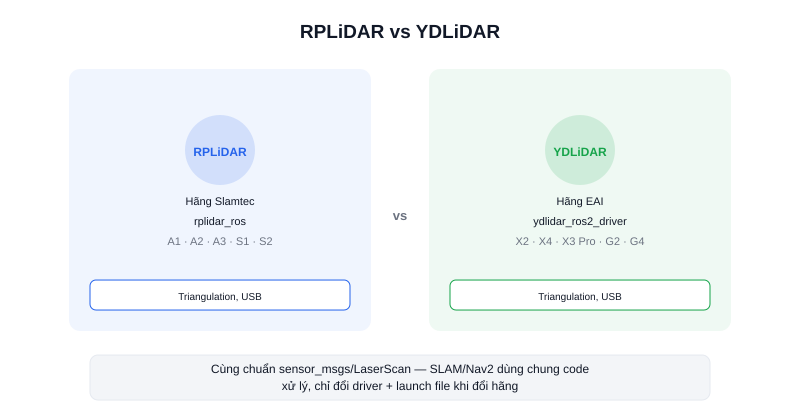

Khi tìm mua LiDAR 2D giá hợp lý cho robot ROS2, hai cái tên xuất hiện nhiều nhất là **RPLiDAR** (hãng Slamtec) và **YDLiDAR** (hãng EAI) — cả hai đều dùng nguyên lý tam giác đạc quang học, đều có driver ROS2 chính thức, và đều phổ biến trong cộng đồng robot DIY lẫn các dự án AMR thực tế.

## Điểm chung

Cả hai dòng đều là LiDAR 2D triangulation, xuất dữ liệu chuẩn `sensor_msgs/LaserScan`, và đều có gói driver ROS2 riêng cài qua `colcon build`:

| | RPLiDAR | YDLiDAR |
|---|---|---|
| Hãng | Slamtec | EAI (Yourdon) |
| Gói driver ROS2 | `rplidar_ros` | `ydlidar_ros2_driver` |
| Nguyên lý đo | Triangulation | Triangulation |
| Dải sản phẩm | A1, A2, A3, S1, S2... | X2, X4, X3 Pro, G2, G4... |
| Kết nối | USB (qua bo chuyển đổi UART-USB) | USB (qua bo chuyển đổi UART-USB) |

## Khác biệt thực tế khi chọn mua

Cả hai hãng đều chia sản phẩm thành nhiều tầng (entry-level giá rẻ tầm quét ngắn, tới bản cao cấp tầm quét xa và tần số quét cao hơn) — nên **so sánh "RPLiDAR vs YDLiDAR" chung chung ít ý nghĩa bằng so sánh 2 model cụ thể cùng tầm giá**. Ví dụ YDLIDAR X3 Pro (tầm quét ~0.12–8m, ~8Hz, độ phân giải góc ~0.7°) nằm ở phân khúc entry-mid, tương đương các model tầm trung của RPLiDAR — cả hai đủ dùng tốt cho AMR trong nhà cỡ nhỏ.

Trong cộng đồng ROS2, tài liệu và ví dụ cho RPLiDAR có phần nhiều hơn một chút do xuất hiện sớm hơn, nhưng YDLiDAR cũng được hỗ trợ tốt và driver `ydlidar_ros2_driver` cập nhật thường xuyên cho ROS2 Humble trở lên. Trên thực tế, khác biệt về chất lượng dữ liệu giữa hai hãng ở cùng phân khúc giá là không lớn — quyết định thường dựa vào giá bán, hàng có sẵn, và driver nào tương thích tốt hơn với bản ROS2 đang dùng.

### Lưu ý khi thay thế qua lại

Vì cả hai xuất cùng chuẩn `sensor_msgs/LaserScan`, về mặt phần mềm (SLAM, Nav2) có thể đổi từ hãng này sang hãng kia mà không cần sửa code xử lý dữ liệu — chỉ cần đổi package driver và launch file tương ứng.

## Kết luận

RPLiDAR và YDLiDAR đều là lựa chọn an toàn cho LiDAR 2D trong dự án AMR ROS2 — thay vì chọn theo tên hãng, nên so sánh model cụ thể theo đúng nhu cầu tầm quét/tần số quét, và ưu tiên model có driver ROS2 ổn định cho đúng bản ROS2 đang dùng.
