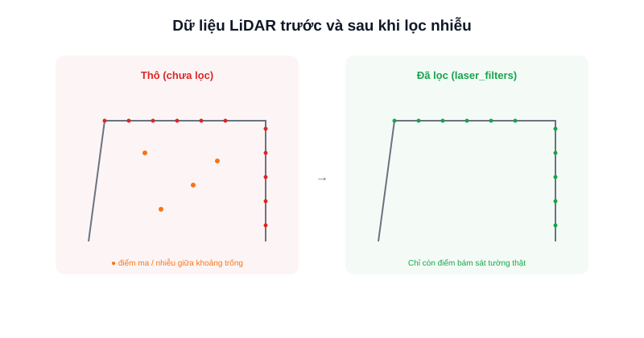

Chạy SLAM lần đầu, nhiều người ngạc nhiên khi bản đồ ra không sạch như demo — có những chấm lẻ tẻ xuất hiện giữa khoảng trống, hoặc tường bị "dày" bất thường. Phần lớn nguyên nhân đến từ **nhiễu trong dữ liệu LiDAR thô**, chưa được lọc trước khi đưa vào SLAM.



## Vì sao LiDAR có nhiễu

- **Bề mặt phản xạ kém hoặc trong suốt:** kính, vật đen tuyền, hoặc bề mặt gương phản xạ tia laser đi hướng khác thay vì phản xạ thẳng về cảm biến, gây ra khoảng đo sai hoặc thiếu điểm.
- **Nhiễu ngẫu nhiên (random noise):** ngay cả bề mặt bình thường, LiDAR triangulation giá rẻ vẫn có sai số vài phần trăm ở khoảng cách xa — biểu hiện thành các điểm "rung" nhẹ quanh vị trí thật.
- **Vật thể động:** người đi ngang qua trong lúc quét bị ghi lại như một "vật cản" tạm thời, có thể để lại vệt mờ trong bản đồ nếu không được lọc theo thời gian.
- **Điểm ma (outlier) đơn lẻ:** đôi khi một vài điểm xuất hiện hoàn toàn vô lý giữa không gian trống do nhiễu điện tử hoặc phản xạ chéo từ vật ở gần.

## Các bộ lọc phổ biến trong ROS2

Gói `laser_filters` cung cấp sẵn nhiều bộ lọc có thể chèn vào pipeline trước khi dữ liệu tới SLAM, cấu hình qua YAML mà không cần viết code:

```yaml
# ví dụ config cho laser_filters
scan_filter_chain:
  - name: range_filter
    type: laser_filters/LaserScanRangeFilter
    params:
      lower_threshold: 0.12   # bỏ điểm gần hơn mức LiDAR đo tin cậy được
      upper_threshold: 8.0    # bỏ điểm xa hơn tầm quét thực tế

  - name: speckle_filter
    type: laser_filters/LaserScanSpeckleFilter
    params:
      max_range_difference: 0.2   # gộp/loại điểm lẻ tẻ khác biệt bất thường với điểm lân cận
```

- **Range filter:** loại bỏ điểm nằm ngoài tầm đo tin cậy của cảm biến (quá gần hoặc quá xa so với thông số nhà sản xuất).
- **Speckle filter:** phát hiện và loại các điểm đơn lẻ khác biệt bất thường so với các điểm lân cận — xử lý đúng loại "điểm ma" hay gặp.
- **Shadow filter:** loại điểm nằm ở góc quét gần như song song với bề mặt vật cản, nơi sai số triangulation lớn nhất.

## Kết luận

Nhiễu trong dữ liệu LiDAR là bình thường, không phải dấu hiệu cảm biến hỏng — quan trọng là lọc đúng loại nhiễu trước khi đưa vào SLAM thay vì để thuật toán SLAM tự "gánh" nhiễu thô. Bắt đầu với `laser_filters` là đủ cho hầu hết trường hợp AMR trong nhà trước khi cần đến các kỹ thuật lọc phức tạp hơn.
