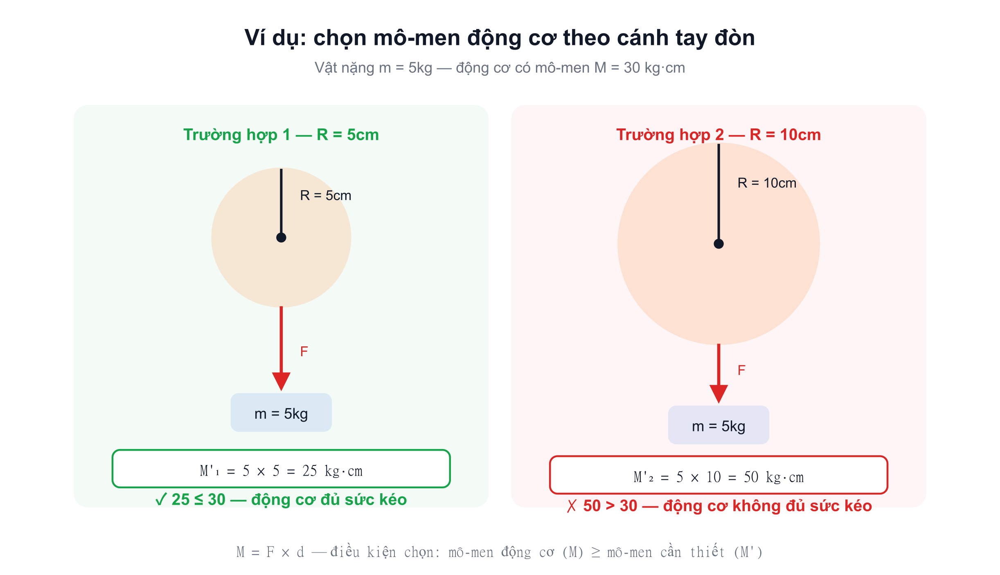
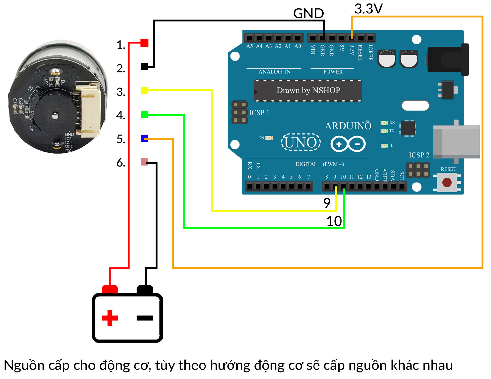

Động cơ DC giảm tốc dòng GA25-370, thân nhỏ Ø25mm, tích hợp sẵn encoder quang học 2 kênh (quadrature) — cùng nguyên lý với [Động Cơ DC Giảm Tốc JGB37-520](/shop/motor/dong-co-jgb37-520-12v-encoder) nhưng gọn hơn, phù hợp robot cỡ nhỏ.

Có tới 11 mức tốc độ (12–1360 RPM) cùng một kiểu thân, chỉ khác tỉ số truyền hộp số — cho phép chọn đúng điểm cân bằng giữa tốc độ và mô-men theo từng ứng dụng thay vì phải đổi sang model động cơ khác.

## Vì sao chọn GA25 kèm Encoder

Không có encoder, driver chỉ biết "đã gửi bao nhiêu PWM", không biết trục **thực sự** quay bao nhiêu vòng — không đủ dữ liệu cho vòng lặp PID giữ tốc độ hay tính odometry. Bản GA25-370 này tích hợp sẵn đĩa encoder ngay trong thân động cơ, không cần lắp thêm rời. Kích thước nhỏ (Ø25mm) khiến dòng này đặc biệt phù hợp robot dò line, robot mê cung, và robot tự cân bằng 2 bánh — những thiết kế cần động cơ nhẹ, gọn hơn dòng GA37/JGB37.

## Phương pháp lựa chọn động cơ (Motor) có mô-men xoắn phù hợp với ứng dụng thực tế

Mô-men xoắn theo đơn vị quốc tế (SI) thường dùng N·m (hoặc N·cm...), nhưng nhà sản xuất động cơ Trung Quốc thường dùng đơn vị **kg·cm** cho người dùng dễ hiểu hơn. Quy đổi gần đúng khi cần tính toán: **1 kg·cm ≈ 0.1 N·m**.

Khi chọn động cơ, muốn biết động cơ đó kéo/nâng được bao nhiêu kg cần biết thêm thông số **"cánh tay đòn" (d)** — khoảng cách từ vector lực đến tâm trục động cơ (với bánh xe, d chính là bán kính bánh R).

Điều kiện lựa chọn: **Mô-men xoắn động cơ (M) ≥ mô-men xoắn tạo ra bởi vật nặng trên trục động cơ (M')**, với công thức tính mô-men xoắn là **M = F × d**.

Trong thực tế, lực kéo (F) đúng ra là trọng lực của vật (P), nhưng để đơn giản hoá, nhà sản xuất Trung Quốc thường cho F = khối lượng vật m (đơn vị kg), tức **M' = m × d**.

Ví dụ: với vật nặng m = 5kg — trường hợp bán kính R = 5cm cho M'₁ = 5 × 5 = 25 kg·cm; trường hợp R = 10cm cho M'₂ = 5 × 10 = 50 kg·cm. Nếu dùng động cơ có mô-men M = 30 kg·cm, động cơ chỉ đủ sức kéo vật ở trường hợp 1 (25 kg·cm ≤ 30 kg·cm), không đáp ứng được trường hợp 2 (50 kg·cm > 30 kg·cm).

Áp dụng cho GA25-370: đối chiếu mô-men cần thiết (M') tính được với cột **"Mô-men có tải"** hoặc **"Mô-men khoá trục"** trong bảng thông số theo từng mức RPM bên dưới, và nên chừa biên an toàn — không chọn sát mức mô-men khoá trục tối đa.

## Sơ đồ chân (pinout)

| Dây | Chức năng |
| --- | --- |
| M1 | Dây nguồn cấp cho động cơ |
| M2 | Dây nguồn cấp cho động cơ (còn lại) |
| GND | Nguồn cấp encoder, 0VDC |
| VCC | Nguồn encoder 3.3V |
| C1 | Kênh trả xung B |
| C2 | Kênh trả xung A |

## Sơ đồ kết nối tham khảo

Sơ đồ mẫu dưới đây minh hoạ cách đấu 6 dây của GA25-370 với Arduino UNO và nguồn ngoài — đối chiếu với bảng sơ đồ chân ở trên để xác định đúng từng dây trước khi lắp. Nguồn cấp cho động cơ tuỳ theo chiều quay mong muốn sẽ đấu khác nhau.

> **Lưu ý:** Sơ đồ trên chỉ mang tính tham khảo (từ tài liệu nhà cung cấp), phù hợp cho việc test đọc encoder nhanh. Khi điều khiển tốc độ bằng PWM trong thực tế, nên đấu qua driver động cơ (L298N, L293D...) như mô tả ở phần Hướng dẫn sử dụng bên dưới, không cấp nguồn trực tiếp cho động cơ từ vi điều khiển.

## Bảng thông số theo từng tuỳ chọn tốc độ (RPM)

> **Lưu ý:** Bảng dưới đây tổng hợp từ tài liệu nhà cung cấp, **chưa tự kiểm chứng thực tế** — dùng để tham khảo chọn mức RPM phù hợp, không phải số liệu đo đạc độc lập. Không phải nhà cung cấp nào cũng có sẵn đủ 11 mức, xác nhận tồn kho mức RPM cần dùng qua Messenger/Zalo trước khi đặt hàng.

| RPM không tải | Dòng không tải | RPM có tải | Dòng có tải | Mô-men có tải | Mô-men khoá trục | Dòng khoá trục | Khối lượng | Dài hộp số |
| --- | --- | --- | --- | --- | --- | --- | --- | --- |
| 1360 | 0.07A | 1046 | 0.3A | 0.1 kg·cm | 0.4 kg·cm | 1.8A | 83g | 18mm |
| 620 | 0.07A | 477 | 0.3A | 0.2 kg·cm | 0.9 kg·cm | 1.8A | 83g | 17.5mm |
| 280 | 0.07A | 215 | 0.3A | 0.4 kg·cm | 2 kg·cm | 1.8A | 86g | 19mm |
| 170 | 0.07A | 131 | 0.3A | 0.69 kg·cm | 3.3 kg·cm | 1.8A | 88g | 21mm |
| 130 | 0.07A | 100 | 0.3A | 1 kg·cm | 4 kg·cm | 1.8A | 90g | 23mm |
| 77 | 0.07A | 59 | 0.3A | 1.5 kg·cm | 5.5 kg·cm | 1.8A | 90g | 23mm |
| 60 | 0.07A | 46 | 0.3A | 2 kg·cm | 7.3 kg·cm | 1.8A | 90g | 23mm |
| 46 | 0.07A | 35 | 0.3A | 2.5 kg·cm | 9.2 kg·cm | 1.8A | 89g | 25mm |
| 26 | 0.07A | 20 | 0.3A | 4.4 kg·cm | — | — | 89g | 25mm |
| 16 | 0.07A | — | — | 7.3 kg·cm | — | — | 91g | 27mm |
| 12 | 0.07A | 9 | 0.3A | 9.7 kg·cm | — | — | 91g | 27mm |
